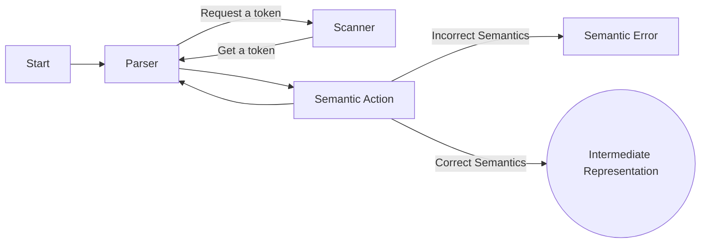
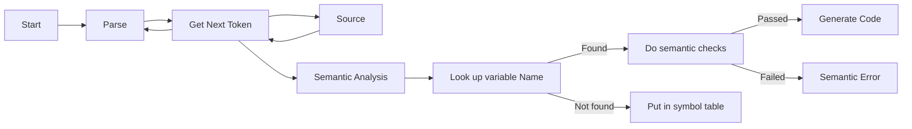

### Objectives

* Describe the basic backgrounds of compilers  

### What is a Compiler?
A compiler is a program that translates another program from a source language to a target language. 

Source languages are typically higher level like C/C++ and the lower level language is the machine code. 

The process is source file -> compiler -> executable -> run on processor. 


### What is an Interpreter?

Interpreters also work by reading in high level source files, but it is reading in the program line by line and displaying the results on the screen. 

It does not leave any executable in place. Python for example, is an interpreted language. 
The biggest difference between interpreted and compiled programs is that execution is way faster. 

### Why Compilers?
In the early days, it was very time consuming / annoying to program at low levels. By abstracting away things to a higher level language, software was able to evolve much quicker. 

### How Compilers Work: Overview (The Front End of Compiler)



The parser tracks where we are during the compilation in the program. It is a key phase to track the amount of sentences seen, processed, translated, etc..
The parser invokes the scanner, to get the next token (or word). Scanner gets the next token from source file and gives it to the parser. 
When we have a partial sentence, we are ready to begin semantic analysis. 
Semantic analysis will look up variable names. It will maintain the information of declared variables in a structure called "the symbol table". 
If the variable name is found, it performs some semantic checks. It gets it attributes (type, scope, etc...). 
If the variable name is not found, it will be added to the symbol table. 

Once the semantic checks have passed, we will generate intermediate code. 




### Compiler Parts
Front End:
1. Lexical Analyis - scanning activity to scan and group characters into the words
2. Syntax Analasis - parsing and finding out if the syntax is correct
3. Semantic Analsys - find out if the statement if semantically meaninful

Back End:
4. Code Generation - Turn it to the assembly level
5. Optimization - Make sure the code is efficient

### The Big Picture

Scanning: Converting input text into stream of known objects called tokens. Simplifies parsing process. 
Parsing: Translating code to rules of grammar. Building representation of code. 

Lexical rules of language dictage how legal word is formed by concatenating alphabet. 
Grammar dictates syntactic rules of language. ie, how lefal sentence could be formed. 

### Scanning and Tokenization

Token Buffer contains: tokens being identified. 
Keeps extendng a token by reading characters one at a time. Finally, when it sees something it cannot legally extend to the token, it know it has gone too far, and it terminates the current characters and send it to the parser. 

### Parser
Goal is to check the syntax using grammatical rules, and also control the overall operation. It also demands the scanner to produce a token. 

Syntax checks are much less expensive than semantic checks. 
#### Parser: Grammar Rules
```
<C-PROG>     -> MAIN OPENPAR <PARAMS> CLOSEPAR <MAIN-BODY>
<PARAMS>     -> NULL
<PARAMS>     -> VAR <VARLIST>
<VARLIST>    -> , VAR <VARLIST>
<VARLIST>    -> NULL
<MAIN-BODY>  -> CURLYOPEN <DECL-STMT> <ASSIGN-STMT> CURLYCLOSE
<DECL-STMT>  -> <TYPE> VAR <VARLIST>;
<ASSIGN-STMT>-> VAR = <EXPR>;
<EXPR>       -> VAR
<EXPR>       -> VAR <OP> <EXPR>
<OP>         -> +
<OP>         -> -
<TYPE>       -> INT
<TYPE>       -> FLOAT
```
If it is found in violation of syntax, there is no point in doing a semantic check. 

#### Parser Overview
1. Start matching using a rule
2. When match takes place at certain position, move further (get next token and repeat)
3. If expansion needs to be done, choose appropriate rule (If no rule found, declare error)
   1. If several rules found, the grammar is ambiguous and something is wrong with it

#### Parser Ambiguity
Ambiguity can lead to understanding a given sentence in two different ways which allows assigning two meanings to the same sentence. 
Ex: 2 * 2 + 3
1. We multiply 2 by 2 and then add 3.
2. We add 2 and 3 together and then multipy 2.


### Syntax vs Semantics
Syntax checks the structure of the line you are making.
Semantics is more of if that line makes sense (like a variable being used that was never declared.)

If we find a statement syntactically problematic, no point in checking semantics. 

During parsing (syntax checking), we have
1. Tokens are matches and consumed by parser
2. Symbol Tables
3. Variables have attributes
4. Declaration attaches attributes to variables

### Symbol Table
A symbol table shows us which values are declared in the program and within the current scope. 

Ex:

int a, b;

| Name | Type | Scope  |
|------|------|--------|
| a    | int  | "main" |
| b    | int  | "main" |


### Semantic Actions

1. Enter Variable declaration into symbol table
2. Look up variables in symbol table
3. Do binding of looked-up variables (scoping, rules, etc...)
4. Do type checking for compatibility
5. Keep the semantic context of processing (like the current type in the subexr)

Ex:

a + b +c -> t1 = a + b; t2 = t1 + c

We maintain the type of the expression to be "int" for the context propagation. 

#### Implementation
Action symbols embedded in the grammer - each action symbol represents a semantic procedure. These procedures do things and/or return values. 
1. The are doing semantic analysis
2. Getting info from symbol table
3. Type checking
4. Installing info in symbol table

Semantic procedures are called by parser at appropriate places during parsing, like when enough of a sentence has been seen. 

Semantic stack implements and stores semantic records. 

#### Symbols
```
<decl-stmt> -> <type>#put-type <varlist>;#do-decl
<type>      -> int | float
<varlist>   -> <var>#add-decl <varlist>
<varlist>   -> <var>#add-decl
<var>       -> ID#proc-decl

#put-type   puts given type on semantic stack
#proc-decl  builds decl record for var on stack
#add-decl   builds decl-chain
#do-decl    traverses chain on semantic stack using
            backwards pointers entering each var into
            symbol table
```


Types of Semantic actions:
1. Checking: binding, type, compatibility, scoping, etc...
2. Translation: generate temp vals, propagate them to keep semantic context
