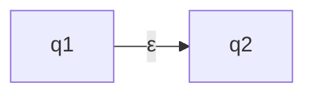
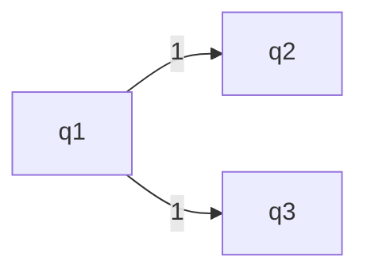
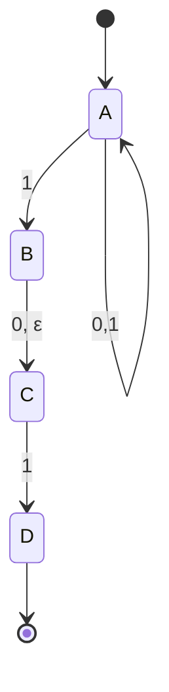
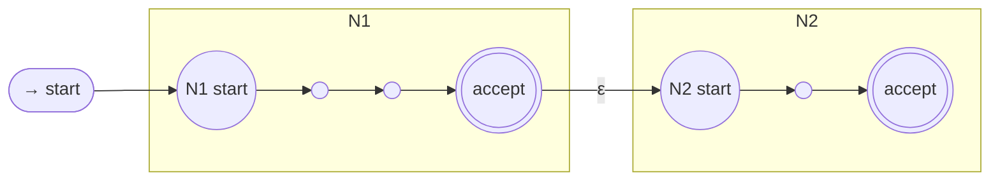
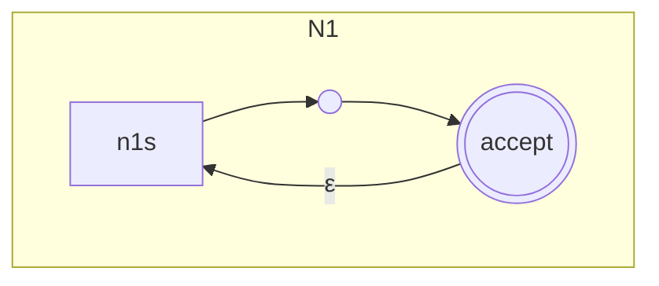
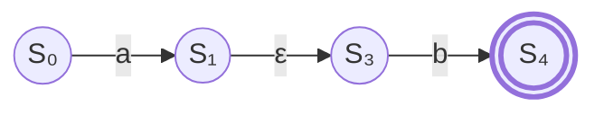
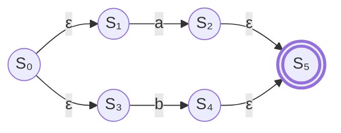
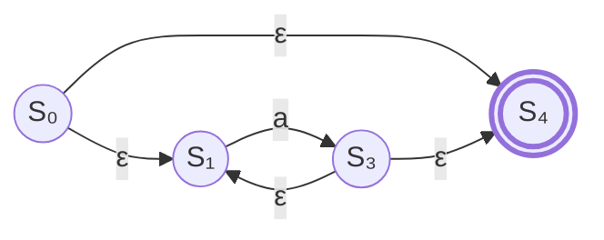

### NFA - Nondeterministic Finite Automaton

- Same input may produce multiple paths
- Allows transition with an emtpy string
- Transition from one state to different states on a given character

**Empty String Transition (No input consumed)**


**Nondeterministic Transition**


#### How NFA Works
**Read 01011**


```mermaid
flowchart TB
  subgraph t0["ε"]
    A0[A]
  end

  subgraph t1["0"]
    A1[A]
  end

  subgraph t2["1"]
    A2[A]
    B2[B]
    C2[C]
  end

  subgraph t3["0"]
    A3[A]
    C3[C]
  end

  subgraph t4["1"]
    A4[A]
    B4[B]
    C4[C]
    D4[D]
  end

  subgraph t5["1"]
    A5[A]
    B5[B]
    C5[C]
    D5[D]
    E5[E]
  end

  A0 --> A1 --> A2 --> A3 --> A4 --> A5
  A1 --> B2 -->C3 --> D4 --> E5
  A1 --> C2
  A3 --> B4
  A3 --> C4 --> D5
  A4 --> B5
  A4 --> C5
  ```


A transition function  
δ : Q × Σε → P(Q)

Σε = Σ ∪ {ε}

P(Q) is the power set of Q


### NFA Proof
We can turn every NFA into a DFA and vise versa. 
DFA and NFA are equivalent computational models. 

Proof Idea: When keeping track of nondeterministic computation of NFA N, use many "fingers" to point at the set of states of N that can be reached on a given input string. 

**Closure property**: A set is said to be closed for a specific operation, if, when the operation is performed on member of the set, it produces a member of the set. 

#### Closure Under Union
The regular languages are 'closed' under the union operation. 
If L1 and L2 are regular languages, then L1 U L2 is regular. 
```mermaid
flowchart LR
  %% Closure under Union: N = N1 ∪ N2

  start([→ start]) --> s0((new start))

  s0 -- "ε" --> n1s((N1 start))
  s0 -- "ε" --> n2s((N2 start))

  subgraph N1["N1"]
    direction LR
    n1s --> n1a(( ))
    n1a --> n1b(( ))
    n1b --> n1f(((accept)))
  end

  subgraph N2["N2"]
    direction LR
    n2s --> n2a(( ))
    n2a --> n2f(((accept)))
  end
```
As you can see above, if L1 is regular, and L2 is regular, and L1 U L2 is regular. 

#### Closure Under Concatenation

You can glue the machines together in this case to make L1·L2 also regular. 

#### Closure Under Star

You can loop the machine any number of times.

### DFA: Regular Language

Regular Expression <-> NFA <-> DFA = Regular Langauge. 

> A language is regular if and only if some regular experssion describes it
{: .prompt-tip }

Regular expression convertible to NFA, convertible to DFA. Thus DFA exists for every regular expression and thus, language is regular.

### Scanner Construction
I would have written more in here and the following subsections, but there was an explicit copyright for some of these following slides and I dont wanna mess with that

Take the regex -> make a NFA with it -> make DFA -> downsize the DFA

We can build an NFA for each regex term and combine them with ε transitions. 

#### Thompson's Construction

We basically just isolate individual chars in the regex and slowly start connecting them with the proofs above. Like if we just had the character x. We would have

State 1 -> x -> Final State


If we wanted to have a union with another character, we would combine them like in the Union proof
For concat, same concept. 
If we wanted a star, we would need to Have 4 states, with lots of epsilon transitions. Where the middle two are connected by a, but can loop back through and epsilon, and the start can go to the end or the middle two on an epsilon. 

#### Concat (ab)


#### Union (a|b)

#### Star (a*)


#### NFA to DFA with Subset Construction
Start state -> Take its ε closure (all the states that it can go to from ε) -> Take the whole alphabet and runs it through the ε possibility to see where it ends up -> Repeat
```
start_state = epsilon_closure({nfa_start})

worklist = [start_state]
seen = {start_state}

while worklist:
    current = worklist.pop()

    for symbol in alphabet:
        next_state = compute_next(current, symbol)

        if next_state not in seen:
            seen.add(next_state)
            worklist.append(next_state)
```
It is O(2^NFA states) worst case. 
This is a fixed point computation. It stops when we stop adding to the worklist basically


### DFA Minimization
**Minimum DFA** = DFA with smallest number of states. 

**Reversing** an NFA means swapping final and initial states, as well as reversing edges. 

To take the **subset** of an NFA means to get the DFA that results from applying subset construction algo. 

To get a **reachable** version of the NFA is to get rid of all states that cannot be reached from initial state

Minimization steps:
reachable(subset(reverse(reachable(subset(reverse(NFA))))))

```